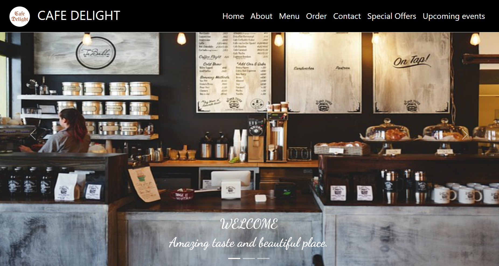
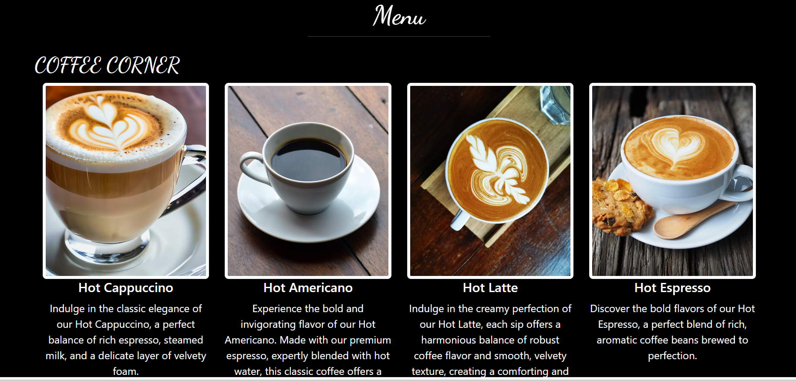

# ☕ Café Delight Website

A modern and responsive café website built using **HTML, CSS, JavaScript, and Bootstrap**.
This project showcases a stylish UI for a café, including menu display, events, and contact features.

---

## 🚀 Features

* 🏠 Attractive Home Page
* 📋 Interactive Menu Section
* 🎵 Café Concerts & Musical Nights Section
* 📱 Fully Responsive Design (Mobile + Desktop)
* 📩 Contact Form UI
* 🎨 Clean and modern Bootstrap styling

---

## 🛠️ Technologies Used

* HTML5
* CSS3
* JavaScript
* Bootstrap

---

## 📂 Project Structure

```
Café-Delight/
│── index.html
│── css/
│   └── style.css
│── js/
│   └── script.js
│── images/
```

---

## 📸 Screenshots

### 🏠 Home Page


### 📋 Menu Page

---


---

## ⚙️ How to Run Locally

1. Clone the repository

```
git clone https://github.com/Priya301224/Cafe-Delight.git

2. Open the project folder

3. Run `index.html` in your browser

---

## 📌 Future Improvements

* Add backend for online orders
* Integrate payment gateway
* Improve animations and UX

---

## 🙌 Acknowledgement

This project was created as part of a web development learning journey.

---

## ⭐ If you like this project

Give it a ⭐ on GitHub!

---
