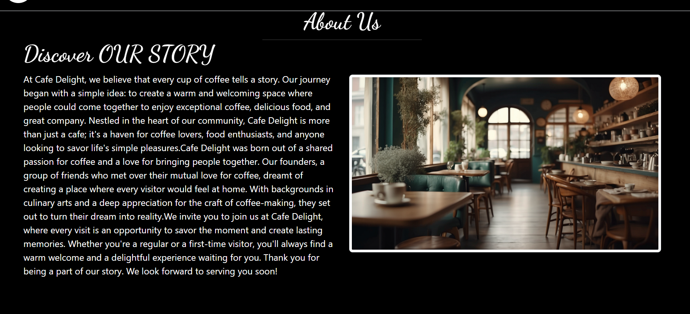
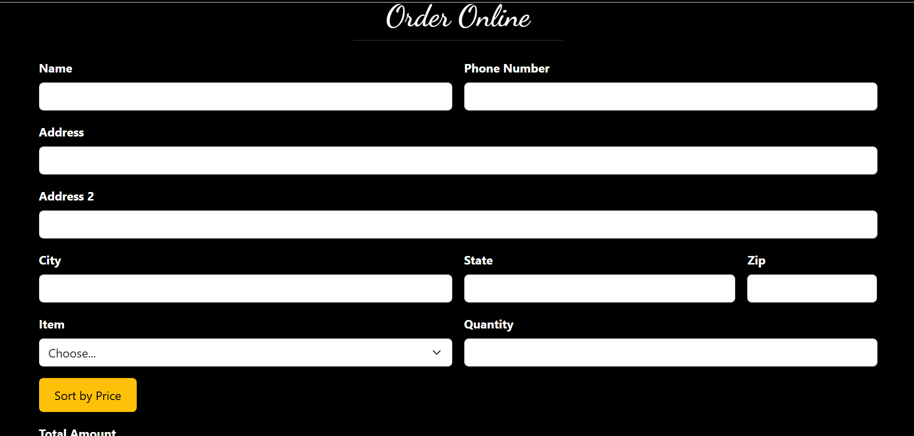
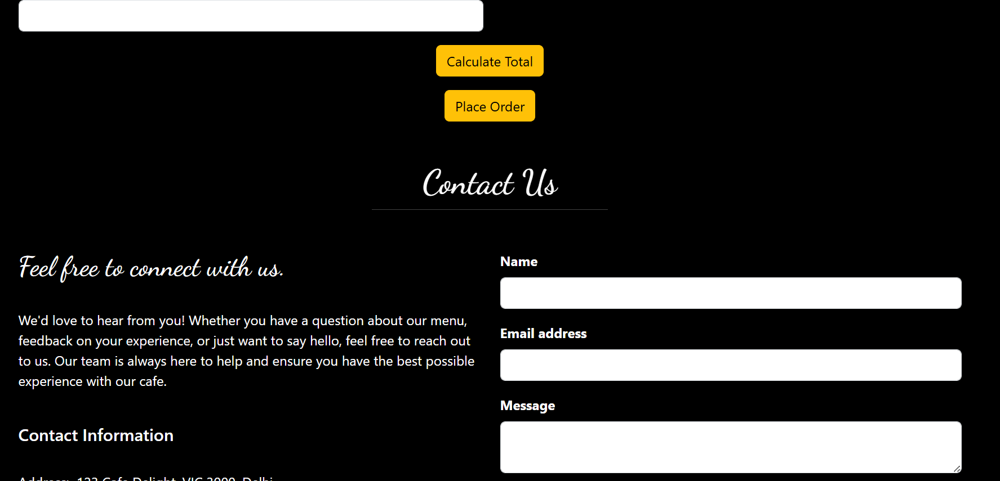

# ☕ Café Delight Website

A modern and responsive café website built using **HTML, CSS, JavaScript, and Bootstrap**.
This project showcases a beautifully designed user interface for a café, including menu browsing, events, ordering, and contact features.

---

## 🚀 Features

* 🏠 Attractive Home Page
* 📋 Interactive Menu Section
* 📖 About Us Page
* 🎉 Events & Musical Nights Section
* 🔐 User Login Page
* 🛒 Online Order Page UI
* 📞 Contact Us Page
* 📱 Fully Responsive Design (Mobile + Desktop)

---

## 🛠️ Technologies Used

* HTML5
* CSS3
* JavaScript
* Bootstrap

---

## 📂 Project Structure

```
Café-Delight/
│── index.html
│── about.html
│── menu.html
│── events.html
│── login.html
│── order.html
│── contact.html
│── css/
│   └── style.css
│── js/
│   └── script.js
│── images/
│   ├── home.png
│   ├── menu.png
│   ├── aboutus.png
│   ├── events.png
│   ├── login.png
│   ├── order.png
│   └── contactus.png
```

---

## 📸 Screenshots

Explore the user interface of **Café Delight**:

### 🏠 Home Page


### 📋 Menu Page


### 📖 About Us



### 🎉 Events & Concerts


### 🔐 Login Page


### 🛒 Order Page



### 📞 Contact Us



---


## ⚙️ How to Run Locally

1. Clone the repository

```
git clone https://github.com/Priya301224/Cafe-Delight.git
```

2. Open the project folder

3. Run `index.html` in your browser

---

## 📌 Future Improvements

* Add backend for real-time orders
* Integrate payment gateway
* Improve animations and UI/UX
* Add user authentication system

---

## 🙌 Acknowledgement

This project was created as part of a web development learning journey.

---

## ⭐ Support

If you like this project, consider giving it a ⭐ on GitHub!

---
